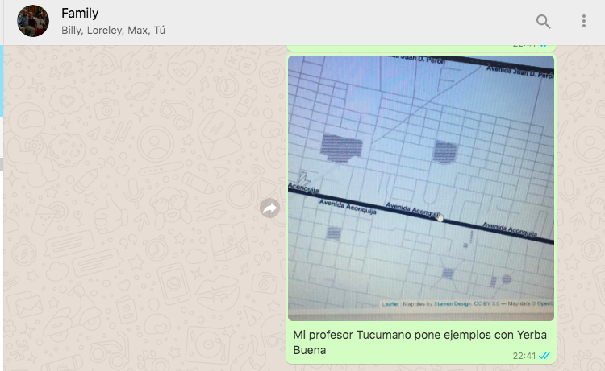
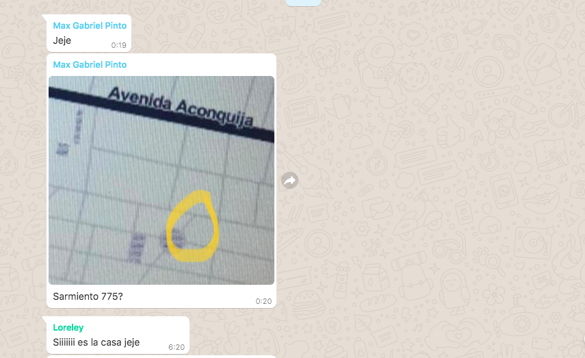

```{r setup, include=FALSE}
knitr::opts_chunk$set(echo = TRUE, warning = FALSE, message = FALSE)
```

```{r librerías, include=FALSE}
library(tidyverse)
library(polAr)
library(ggplot2)
library(leaflet)
library(knitr)

```


###En la clase 8, que vi grabada porque ese día no tenía internet, el Tucu hizo un ejemplo de mapas interactivos con Yerba Buena, Tucumán. Mandé una foto de la pantalla a mi familia, porque vivimos en Yerba Buena hasta 1994.

```{r, echo=FALSE, out.width="100%"}

```

###Yo era muy chica para acordarme dónde vivía, pero mi hermano identificó la casa en la capturanque mandé. Y mi madre confirmó.

```{r, echo=FALSE, out.width="100%"}

```

###Y con esos datos reproduje el gráfico del Tucu y marqué la casa con leaflet.

```{r mapa}

map_tuc <- get_geo("TUCUMAN")

leaflet(map_tuc) %>%
  addPolygons() %>%
  addProviderTiles(providers$Stamen.Toner) %>%
  addMarkers(lng = -65.276472, -26.819889)

```